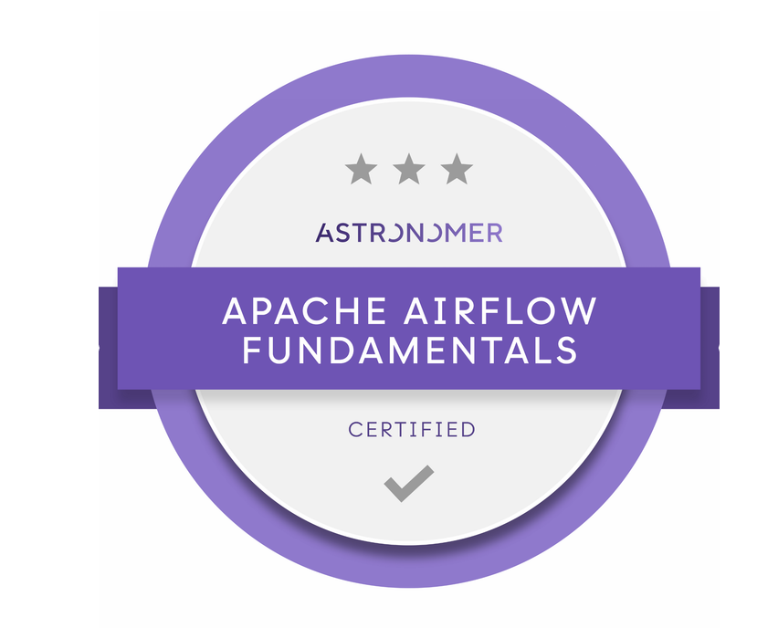

## Hi there 👋

I'm a Data Engineer  with over 6 years of experience designing, deploying, and leading end-to-end Data Pipelines Solutions across sector like Retail, E-commerce, and Financial Services.

My work focuses on building robust and scalable Data Pipelines using cloud platforms such as **GCP**, **AWS**, I specialize in both **Data Pipelines** and **ML Pipelines**, working with structured and unstructured data (text, images, video, audio) in batch and streaming environments.

Some of the areas I work in include:
- **Data Engineering**
- **Machine Learning**
- **Deep Learning**
- **Transformers & LLMs** (Fine-tuning, RAG, LangChain, Hugging Face)

With a strong academic foundation in **Operations Research**, **Optimization**, and ongoing Master's degree in  Artificial Intelligence, I’m passionate about solving complex problems through AI/Data and delivering real-world impact with clean, well-documented code.

## 🌩️ Cloud Certifications

  
  
  

I hold professional certifications GCP and Astronomer Related to Data and ML Pipelines:

- 🟨 [Google Cloud Professional Data Engineer](https://www.credly.com/badges/4648136a-d444-40f8-ab1d-74b8a87d3708)
- 🟨 [Google Cloud Professional Machine Learning Engineer](https://www.credly.com/badges/4c562377-4e88-4586-8fd4-d43cab22f048)
- 🟥 [Astronomer Apache Fundamentals](https://www.credly.com/badges/62b448ff-e608-47a3-8ef4-bdc1d88414d0)

